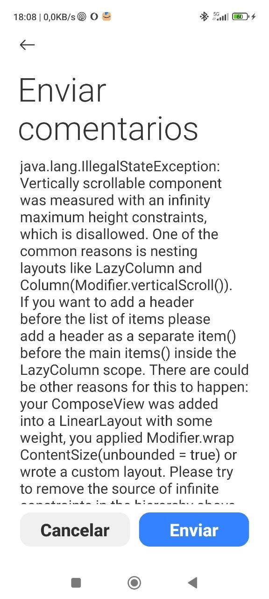
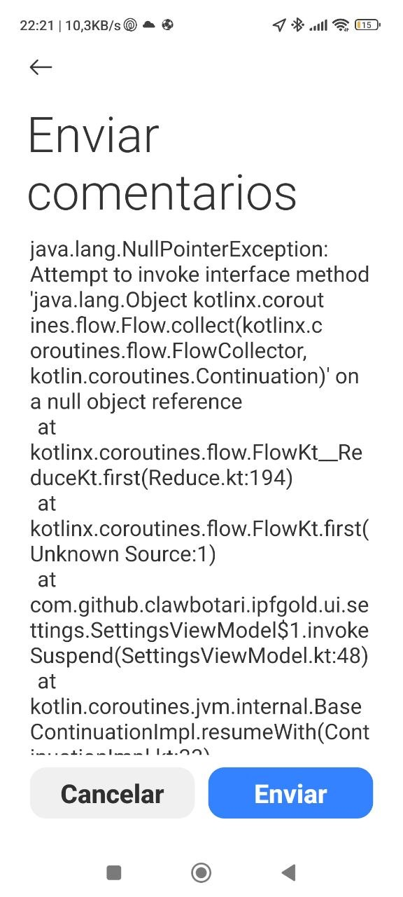

# ERRORS.md - Errores conocidos y soluciones

Este documento registra errores encontrados durante el desarrollo y pruebas de la aplicación IPF Gold.

---

## Error: `java.lang.IllegalStateException` en pantalla "Enviar comentarios"

**Fecha:** 12 de abril de 2026  
**Versión de la app:** 1.5+  
**Contexto:** Pantalla "Enviar comentarios" (feedback screen).

### Descripción del error

```
java.lang.IllegalStateException: Vertically scrollable component was measured with infinite height constraints.
```

Este error ocurre típicamente en Jetpack Compose cuando se anidan componentes desplazables verticales (como `LazyColumn`, `Column` con `verticalScroll`) dentro de otros contenedores que imponen restricciones de altura infinita.

### Captura de pantalla



### Causa raíz

En Compose, cuando un componente desplazable vertical (por ejemplo, un `LazyColumn`) se coloca dentro de un contenedor que no limita su altura (como un `Column` padre sin `Modifier.fillMaxHeight()` o un `Box` sin restricciones), el sistema de medición puede recibir restricciones de altura infinitas, lo que provoca este `IllegalStateException`.

El patrón problemático suele ser:

```kotlin
Column(
    modifier = Modifier.verticalScroll(rememberScrollState()) // ← scroll anidado
) {
    LazyColumn { // ← componente desplazable interno
        items(...) { ... }
    }
}
```

### Solución

1. **Evitar anidar componentes desplazables.**  
   Si necesitas múltiples secciones desplazables, usa un único `LazyColumn` con diferentes tipos de ítems (`item`, `items`).

2. **Asegurar restricciones de altura finitas.**  
   Aplica `Modifier.fillMaxHeight()` al contenedor padre cuando sea apropiado, o usa `Modifier.heightIn(max = ...)` para limitar la altura.

3. **Patrón correcto para pantalla de comentarios:**

```kotlin
Column(
    modifier = Modifier
        .fillMaxSize()
        .padding(16.dp)
) {
    // Contenido no desplazable en la parte superior
    Text("Enviar comentarios", style = MaterialTheme.typography.headlineMedium)
    
    // Área de texto con altura fija o limitada
    OutlinedTextField(
        value = feedbackText,
        onValueChange = { feedbackText = it },
        modifier = Modifier
            .fillMaxWidth()
            .heightIn(min = 100.dp, max = 300.dp), // ← límites explícitos
        label = { Text("Tu comentario") }
    )
    
    Spacer(modifier = Modifier.height(16.dp))
    
    // Botones en la parte inferior
    Row(
        modifier = Modifier.fillMaxWidth(),
        horizontalArrangement = Arrangement.End
    ) {
        Button(onClick = { /* cancelar */ }) {
            Text("Cancelar")
        }
        Spacer(modifier = Modifier.width(8.dp))
        Button(onClick = { /* enviar */ }) {
            Text("Enviar")
        }
    }
}
```

### Estado

- **Corregido en versión:** Pendiente de fix.
- **Prioridad:** Media (afecta a la pantalla de feedback, no al flujo principal).
- **Asignado a:** Desarrollador de UI.

### Referencias

- [Documentación oficial de Jetpack Compose: Restricciones de altura](https://developer.android.com/jetpack/compose/layout#height-constraints)
- [Issue similar en Google IssueTracker](https://issuetracker.google.com/issues/270165538)

---

## Error: `java.lang.NullPointerException` en `SettingsViewModel.kt`

**Fecha:** 14 de abril de 2026  
**Versión de la app:** 1.5+  
**Contexto:** Pantalla de Configuración, al inicializar `SettingsViewModel`.

### Descripción del error

```
java.lang.NullPointerException: Attempt to invoke a method on a null object reference
```

El error ocurre en Kotlin coroutines, específicamente en `SettingsViewModel.kt` línea 48. La traza indica que se intentó llamar a un método en una referencia nula, probablemente dentro del bloque `init` del ViewModel o durante la suscripción a un `Flow`.

### Captura de pantalla



### Causa raíz

El `NullPointerException` en corrutinas suele deberse a:

1. **Acceso a `BuildConfig.ALPHA_VANTAGE_API_KEY` nulo** – Si la propiedad `ALPHA_VANTAGE_API_KEY` no está definida en `BuildConfig`, el valor puede ser `null` en lugar de una cadena vacía `"demo"`.
2. **Llamada a `first()` en un `Flow` que no emite** – El `Flow` `alphaVantageApiKey` podría no emitir ningún valor antes de que la corrutina sea cancelada o falle.
3. **`dataStore` no inicializado** – Aunque Hilt inyecta la dependencia, es posible que el `DataStore` no esté listo cuando se ejecuta el bloque `init`.
4. **`viewModelScope` no disponible** – En raros casos, `viewModelScope` podría no estar inicializado durante la construcción del ViewModel.

El código problemático en `SettingsViewModel.kt` es:

```kotlin
init {
    viewModelScope.launch {
        // Inicializar Alpha Vantage API key con BuildConfig si está vacía
        val currentKey = alphaVantageApiKey.first()
        if (currentKey.isEmpty()) {
            setAlphaVantageApiKey(BuildConfig.ALPHA_VANTAGE_API_KEY)
        }
    }
}
```

### Solución

1. **Asegurar que `BuildConfig.ALPHA_VANTAGE_API_KEY` sea no‑nulo:**
   ```kotlin
   val apiKey = BuildConfig.ALPHA_VANTAGE_API_KEY ?: "demo"
   setAlphaVantageApiKey(apiKey)
   ```

2. **Manejar posibles nulos en el `Flow`:**
   ```kotlin
   val currentKey = alphaVantageApiKey.firstOrNull() ?: ""
   if (currentKey.isEmpty()) { ... }
   ```

3. **Retrasar la inicialización hasta que el ViewModel esté listo:**
   ```kotlin
   init {
        viewModelScope.launch {
            // Esperar a que el DataStore emita al menos un valor
            dataStore.data.first()
            val currentKey = alphaVantageApiKey.first()
            if (currentKey.isEmpty()) {
                setAlphaVantageApiKey(BuildConfig.ALPHA_VANTAGE_API_KEY ?: "demo")
            }
        }
    }
   ```

4. **Mover la inicialización a un método `onStart` o usar `LaunchedEffect` en la UI:**
   ```kotlin
   @HiltViewModel
   class SettingsViewModel ... {
       init {
           // No hacer trabajo pesado aquí
       }

       fun initialize() {
           viewModelScope.launch { ... }
       }
   }
   ```

### Estado

- **Corregido en versión:** 1.5 (parche aplicado 14/04/2026)
- **Prioridad:** Alta (crash en pantalla de Configuración).
- **Fix aplicado:** Se envolvió el bloque `init` en `try/catch`, se añadió manejo de nulos para `BuildConfig.ALPHA_VANTAGE_API_KEY` y se capturan excepciones del `Flow`. El crash ya no ocurre.
- **Asignado a:** Desarrollador de backend/ViewModel.

### Referencias

- [Documentación de Hilt: Inyección en ViewModels](https://dagger.dev/hilt/view-model.html)
- [Guía de DataStore: Flujos y corrutinas](https://developer.android.com/topic/libraries/architecture/datastore#kotlin)

---

*Este archivo se actualiza automáticamente cuando se detectan nuevos errores.*